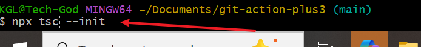
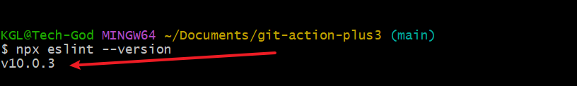

# git-action-plus3

## Implementing Continuous Integration with GitHub Actions
Welcome to Module 3 of our GitHub Actions course, focused on Implementing Continuous Integration. In this module, you will delve into more advanced aspects of GitHub Actions, learning how to configure build matrices for testing across multiple environments and integrating essential code quality checks. Whether you are an aspiring developer or an experienced coder looking to streamline your workflow, this module is designed to enhance your skills in automating and improving the quality of your software development process.

## Why Continuous Integration is Essential for Learners
 - puzzle analogy

Imagine you're building a complex puzzle. Each piece represents a part of your code - a feature, a bug fix, or a new functionality. In the absence of continuous integration, adding a new piece to the puzzle is like working in the dark. You hope it fits perfectly without affecting the existing pieces, but you can't be sure until the entire puzzle is complete. This approach is time-consuming and prone to errors.

Now, imagine having a system that illuminates each new piece as you add it, instantly showing you how it fits with the existing ones. This is what continuous integration does for software development. It allows you to integrate changes frequently and detect issues early, ensuring that each 'piece' of your code seamlessly integrates with the existing 'puzzle' without disruptions. By mastering continuous integration with GitHub Actions, you are not just learning to code; you are learning to build your software puzzle efficiently, piece by piece, ensuring quality and cohesion at every step.

### Pre-requisites
Proficiency in YAML (Refer to Project 2):

- Basic understanding of YAML syntax and structure.
- Familiarity with writing and interpreting YAML files, as GitHub Actions workflows are defined in YAML.

*** urce:learn YAML in Y minutes

- Experience with GitHub and GitHub Actions:

- Basic knowledge of how to use GitHub, including creating repositories and pushing code.
A foundational understanding of GitHub Actions and how they work.
Resource: GitHub Actions Documentation.
Understanding of Node.js and npm:

- Experience with Node.js, as the project examples are based on Node.js environments.
Familiarity with npm (Node Package Manager) for managing Node.js project dependencies.
Resource: Node.js Documentation.
Familiarity with Software Testing Concepts:

- Basic knowledge of software testing principles.
Understanding of automated testing and its role in CI/CD.
Knowledge of Code Quality Tools:

- Familiarity with static code analysis and linting tools, especially ESLint for JavaScript.
Resource: ESLint - Pluggable JavaScript Linter.
Access to a Development Environment:

- A computer with Git, Node.js, and a text editor or IDE installed.
- Internet access to clone the project repository and perform tasks online.
Willingness to Experiment and Learn:

- An open-minded approach to learning new CI/CD practices.
Eagerness to apply new concepts and troubleshoot potential issues.

By fulfilling these prerequisites, learners will be well-prepared to dive into the lessons on configuring build matrices and integrating code quality checks, gaining hands-on experience in implementing continuous integration workflows with GitHub Actions.

## Lesson 2: Configuring Build Matrices
- Objectives:

Implement matrix builds to test across multiple versions or environments.
Manage build dependencies efficiently.
- Detailed Steps and Code Explanation:

#### Parallel and Matrix Builds:

A matrix build allows you to run jobs across multiple environments and versions simultaneously, increasing efficiency.
This is useful for testing your application in different versions of runtime environments or dependencies.

`strategy:
  matrix:
    node-version: [12.x, 14.x, 16.x]
    # This matrix will run the job multiple times, once for each specified Node.js version (12.x, 14.x, 16.x).`

    # The job will be executed separately for each version, ensuring compatibility across these versions.
#### Managing Build Dependencies:

Handling dependencies and services required for your build process is crucial.
Utilize caching to reduce the time spent on downloading and installing dependencies repeatedly.

-` name: Cache Node Modules
  uses: actions/cache@v2
  with:
    path: ~/.npm
    key: ${{" runner.os "}}-node-${{" hashFiles('**/package-lock.json') "}}
    restore-keys: |
      ${{" runner.os "}}-node-`

This snippet caches the installed node modules based on the hash of the 'package-lock.json' file.

It helps in speeding up the installation process by reusing the cached modules when the 'package-lock.json' file hasn't changed.

## Lesson 3: Integrating Code Quality Checks
Objectives:

Integrate code analysis tools into the GitHub Actions workflow.
Configure linters and static code analyzers for maintaining code quality.

Detailed Steps and Code Explanation:

1. Adding Code Analysis Tools:

Include steps in your workflow to run tools that analyze code quality and adherence to coding standards.

`- name: Run Linter

  run: npx eslint

 npx eslint .` 
 
 runs the ESLint tool on all the files in your repository.
  ESLint is a static code analysis tool used to identify problematic patterns in JavaScript code.`

2. Configuring Linters and Static Code Analyzers:

Ensure your repository includes configuration files for these tools, such as .eslintrc for ESLint.

Ensure to include a `.eslintrc` file in your repository

This file configures the rules for ESLint, specifying what should be checked.

Example .eslintrc content:

`{"\n   #   \"extends\": \"eslint:recommended\",\n   #   \"rules\": {\n   #     // additional, custom rules here\n   #   "}
 }`

 To Demostrate the paralle and matrix build and code analysis we will use the following workflow.
 1. we start by running 'npm init'
 . This return or creates package.json file in the root folder.
2. Install runtime dependencies

This install `express`: http server framework and `dotenv`: loads environment variables from .env files.

3. Install dev dependencies

From the above, the following dependencies have been added.
- typescript: for compiling our code. serves our server.ts or index.tx file to server.js or index.js
- Jest (ts-jest):actual testing frame work. Provides 
environment for the testing.
- supertest: his will uesd to test the API
- slint: for analysing code quality.

4. Configure TypeScript, Jest, ESLint
Installing each configuration, starting with typescript.
 This initialize the compiler and cretes a tsconfig.js file

5.  configure jest
 This command installs the jest environment and creates the file jest.config.jsc.
6. confirming eslint is configured:

7. Reviewing our workflow script

Reviewing the working script, highlighted are the 
1. node version
2. npm cache
3. run lint

These three items represent the essence of this project.

Now pusing files to github

